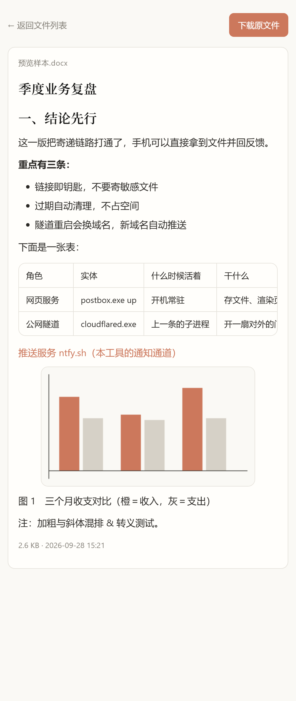
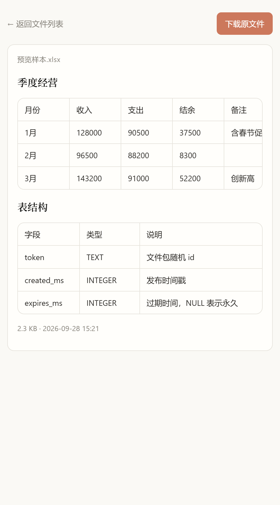
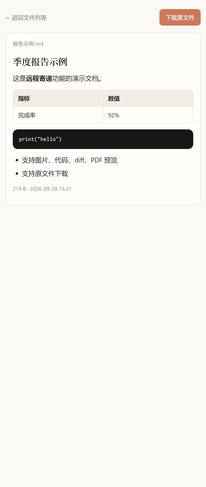
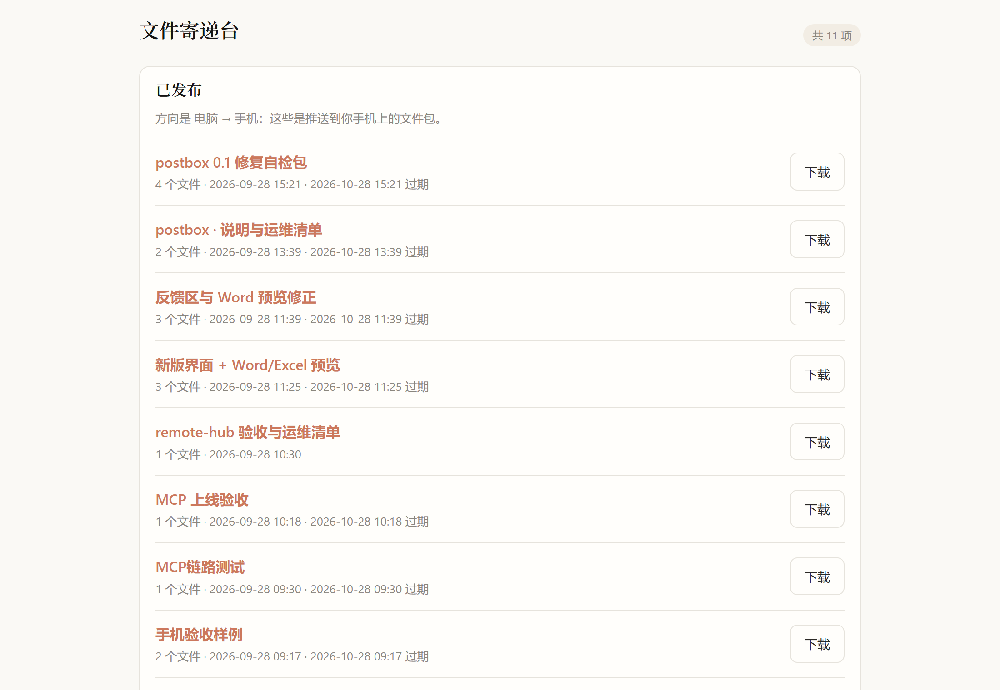
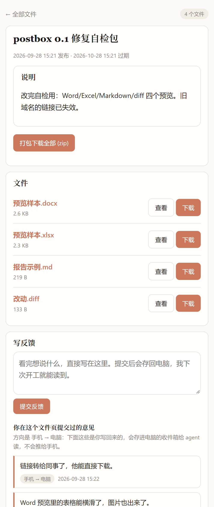

<div align="center">

# postbox

**One sentence from your agent → a link on your phone.**

A self-hosted delivery desk for files an AI agent produces on your computer.
Publish anything, open it on your phone over any network, preview it, forward it,
and send a note back — no cloud drive, no account, nothing stored on a third party.

**English** · [简体中文](README.zh-CN.md)


</div>

---

<table>
<tr>
<td width="33%"></td>
<td width="33%"></td>
<td width="33%"></td>
</tr>
<tr>
<td align="center"><sub><code>.docx</code> with headings, lists, tables and embedded images</sub></td>
<td align="center"><sub><code>.xlsx</code> rendered sheet by sheet, scrollable</sub></td>
<td align="center"><sub>Markdown rendered as a readable page</sub></td>
</tr>
<tr>
<td width="66%" colspan="2"></td>
<td width="34%"></td>
</tr>
<tr>
<td colspan="2" align="center"><sub>Behind <code>/?key=…</code>: every live bundle, plus the notes the phone sent back</sub></td>
<td align="center"><sub>A bundle page on the phone: files, whole-bundle zip, note box</sub></td>
</tr>
</table>

## The problem it solves

You have an agent working on your desktop. It finishes a build, writes a report,
produces a diff — and then hands you a path like `D:\work\out\report.md`, which is
useless from a train, a shop floor or a client meeting.

The usual workarounds all cost something: remote desktop needs a good connection and
a client on both ends; chat apps need you to log in and drag files around; cloud drives
keep copies of your files on someone else's server. `postbox` is the smallest thing
that closes the loop:

```
agent  ──tool call──▶  data/  ◀──serves──  web server  ◀──tunnel──  your phone
                          ▲                                                  │
                          └────────────── your note back ────────────────────┘
```

One call publishes a file. You get a push notification, a random unguessable link,
a page you can read on a 6-inch screen, a download button, and a text box at the
bottom that writes back into an inbox the agent can read.

## What you get

| | |
| --- | --- |
| **Publish** | any number of local files as one link (up to 200 per bundle); multi-file bundles also get a zip |
| **Preview** | Markdown, images, PDF, audio, video, code, diffs, plain text, `.docx`, `.xlsx/.xlsm/.xls/.ods` |
| **Download** | per file or whole bundle, with correct UTF-8 filenames |
| **Forward** | the link works for anyone, no account, no app install |
| **Feedback** | a note box on the bundle page, appended to `data/inbox/feedback.jsonl` and readable by the agent |
| **Expiry** | bundles self-delete (30 days by default, `--days 0` to keep forever), swept hourly and on every publish |
| **Hardening** | CSP + `nosniff` on every response, `/raw/` and `/m/` served under a `sandbox` policy, raw HTML in Markdown neutralised, per-IP rate limit on feedback, streaming responses instead of whole-file reads |
| **Agent control** | a hand-rolled MCP stdio server with 5 tools — no SDK, no framework |
| **Privacy** | nothing is stored on a third party; only bytes the phone actually asked for cross the tunnel |

## Architecture

Four parts, deliberately unaware of each other. The `data/` directory is the only bus:

```
        ┌──────────────── your machine ─────────────────┐
        │                                               │
agent   │  postbox mcp ──write──▶ data/              │
client  │                              │  ▲             │
        │                              │  │ read/write   │
        │                    postbox up (axum server) │
        │                              │  ▲             │
        │                       cloudflared (child)      │
        └──────────────────────────────┼──┼─────────────┘
                                       │  │
                 https://xxx.trycloudflare.com
                                       │  │
        ┌──────────────────────────────▼──▼─────────────┐
        │  your phone  ── browse / download / feedback ──┤──▶ ntfy.sh push
        └────────────────────────────────────────────────┘
```

* `postbox up` — the web server; it spawns `cloudflared` as a child, writes the hostname
  it learns back into `data/config.json`, restarts the tunnel with exponential backoff if
  the child dies, and stops it when the server exits. It also runs an hourly housekeeping
  pass that deletes expired bundles and their leftovers in `data/tmp/`.
* `cloudflared` — a free *quick tunnel*. No signup, no domain, no inbound port on your
  router. The hostname changes every time the tunnel (re)starts, so `up` pushes the new
  one to your phone; links minted before a restart stop working.
* `ntfy.sh` — push notifications, via the system `curl` (shipped with Windows 10+; on
  Linux/macOS install it if missing). Optional: with no topic the tool still works, you
  just read the link from `postbox token` yourself.
* `postbox mcp` — spawned by your agent client, not by you. It never opens a port and
  never contacts the web server; it writes into `data/` and reads `data/config.json`.

Because of that split, the phone keeps working with your agent client closed, and the
agent can publish while the tunnel is briefly down (the link updates itself).

## Quick start

Needs a Rust toolchain — MSRV 1.88, which comes from the `zip` / `calamine` /
`encoding_rs` dependencies, so any current stable works. `autostart` is Windows-only;
macOS and Linux run the server, tunnel and MCP side fine — keep the process alive with
your own supervisor instead.

```bash
git clone https://github.com/<you>/postbox.git
cd postbox
cargo build --release

# 1. create data/ with a random access key and ntfy topic
./target/release/postbox init

# 2. get the tunnel binary (no signup needed)
mkdir -p tools
curl -L -o tools/cloudflared.exe https://github.com/cloudflare/cloudflared/releases/latest/download/cloudflared-windows-amd64.exe

# 3. start the web server + tunnel
./target/release/postbox up
```

The same three steps in PowerShell, which is what most Windows users will paste
(`.\` prefix and `.exe` are required, and there is no `mkdir -p`):

```powershell
git clone https://github.com/<you>/postbox.git; cd postbox
cargo build --release

.\target\release\postbox.exe init
New-Item -ItemType Directory -Force tools | Out-Null
curl.exe -L -o tools\cloudflared.exe https://github.com/cloudflare/cloudflared/releases/latest/download/cloudflared-windows-amd64.exe
.\target\release\postbox.exe up
```

If `cargo build` fails on a fresh Windows machine with a linker error, install
*Build Tools for Visual Studio* with the "MSVC v143 C++ build tools" and "Windows 11 SDK"
components, or use the GNU toolchain (`rustup default stable-x86_64-pc-windows-gnu`).

On macOS or Linux, download the matching asset from the same
[releases page](https://github.com/cloudflare/cloudflared/releases) and point the
`cloudflared` config entry at it (e.g. `postbox config cloudflared tools/cloudflared`).

`up` prints the hostname as soon as the tunnel is ready, and pushes it to your phone:

```
隧道就绪: https://xxxx-yyyy-zzzz-wwww.trycloudflare.com
```

Then, on the phone: install [ntfy](https://ntfy.sh) (Play Store / App Store), subscribe
to the topic printed by `postbox config ntfy_topic get`… or simply set your own
readable one first — `postbox config ntfy_topic my-hub` — and restart `up`.

Sanity check the whole chain:

```bash
./target/release/postbox notify-test          # phone buzzes?
./target/release/postbox publish README.md    # link arrives, opens, previews
./target/release/postbox inbox                # your reply shows up here
```

Finally, keep it running after login (Windows only, hidden window — no taskbar icon):

```bash
./target/release/postbox autostart install
```

> **Stay in one directory.** `data/` is resolved from the current working directory
> unless you pass `--root`, and it holds the access key, the ntfy topic and every
> bundle. Two directories means two unrelated instances — the classic symptom is a
> link that 404s or a phone that never buzzes. `postbox` now stops you: without
> `--root` it bails when the current directory has no `data/config.json`, and with an
> explicit `--root` that has no config it warns that it is standing up a brand-new
> instance there. Pass `--root` on **every** call if your data lives elsewhere,
> including in the MCP config of each agent client.

## Configuration

Everything lives in `data/config.json`. Read or set a value with
`postbox config <key> <value>` (or `get` as the value to print it).

| Key | Default | Meaning |
| --- | --- | --- |
| `port` | `8712` | local HTTP port the server listens on |
| `bind` | `0.0.0.0` | listen address; `0.0.0.0` is what a public tunnel needs, `127.0.0.1` makes it machine-only |
| `access_key` | random UUID | guards the **home page** listing only |
| `base_url` | *(empty)* | public origin; `up` fills it in automatically from the tunnel |
| `tunnel` | `true` | whether `up` also spawns `cloudflared` |
| `ntfy_server` | `https://ntfy.sh` | point at your own ntfy instance if you run one |
| `ntfy_topic` | random UUID | the topic your phone subscribes to; empty disables pushes |
| `cloudflared` | `tools/cloudflared.exe` | path to the tunnel binary, relative to the working dir or absolute |

Notes worth knowing:

* `base_url none` clears a stale hostname; `tunnel false` is useful on a LAN-only setup
  (then use `http://<pc-ip>:8712/?key=…` from your phone).
* `data/` is the whole state of the system. Move it with `--root` (global flag), e.g.
  `postbox --root /srv/hub up`. Every client that publishes must share one root.
* Changing `access_key` or `ntfy_topic` means the phone has to resubscribe.
* `port`, `bind` and `tunnel` are read once at startup, so restart `postbox up` after
  changing them. Everything else is re-read from disk: the server checks
  `data/config.json` again when it validates the home-page key and when it pushes a
  feedback note, so a new `access_key` or `ntfy_topic` takes effect without a restart
  (the phone still has to resubscribe to a changed topic). CLI commands always read
  the file fresh.
* Values are validated before they are written — a non-numeric `port`, a `base_url`
  without a scheme, or an `access_key` shorter than 8 characters is rejected instead of
  silently corrupting the config.

## Command line

| Command | What it does |
| --- | --- |
| `init` | create `data/` and a fresh config |
| `serve` | web server only, no tunnel |
| `up` | web server + supervised tunnel, auto-push the hostname |
| `publish <files…> [--title T] [--note N] [--days 30]` | publish one or more files, print the link, push it |
| `inbox [-n 20]` | show feedback submitted from the phone |
| `token` | print the full home page URL, `https://…/?key=<access key>` |
| `config <key> <value\|get>` | read or write one config field |
| `notify-test` | send a test push |
| `autostart install\|uninstall` | Windows login item, hidden window |
| `mcp` | run as an MCP stdio server (for agent clients) |
| `--version` / `-V` | print the version; `--help` lists every flag |

## Wire it into your agent

`postbox mcp` speaks MCP over stdio with a hand-written newline-delimited JSON-RPC 2.0
loop that implements `initialize`, `ping`, `tools/list` and `tools/call` only. Any client
that supports a **stdio** MCP server can use it — the config is the same three lines
everywhere:

```json
{
  "mcpServers": {
    "postbox": {
      "command": "/absolute/path/to/postbox",
      "args": ["--root", "/absolute/path/to/postbox-project/data", "mcp"]
    }
  }
}
```

| Client | Where it goes |
| --- | --- |
| Claude Desktop | `claude_desktop_config.json` (Settings → Developer) |
| Claude Code | `claude mcp add postbox -- <exe> --root <data> mcp` |
| Cursor / Cline / Windsurf | MCP settings → add a stdio server |
| Qoder | `settings.json` → `mcpServers` |
| Anything else | any file taking `command` + `args`; HTTP-only clients need an `mcp-proxy` shim |

Restart the client, then ask for these by name:

| Tool | Arguments | Purpose |
| --- | --- | --- |
| `publish_file` | `paths[]`, `title?`, `note?`, `days?` | publish existing files, returns the phone URL |
| `publish_text` | `filename`, `content` | publish a blob of text without saving it first (Markdown renders) |
| `check_inbox` | `n?` | read what the user wrote back from their phone |
| `list_bundles` | `n?` | live bundles with their links |
| `get_link` | — | current public hostname + home key (ask after a reboot) |

Phrases that work well, once the tools are registered:

* "Send the report you just wrote to my phone."
* "Summarise what changed and push it to my phone as Markdown."
* "Read what I replied on my phone and fix those three points."
* "What's the current phone address?" — after a reboot the hostname changed.

A few practical caveats, learned the hard way:

1. Each client spawns its own MCP process; several can run at once, since they share one
   `data/` directory. The feedback inbox is therefore global — every client sees it.
2. All of them must point `--root` at the same directory, or two clients publish into two
   silos and only one is reachable from the phone.
3. Rebuilding while the old binary is running fails on Windows ("access denied, os error 5")
   because the exe is locked — by the service **or** by another client's MCP process. Kill
   it first, or build with `--target-dir target/other`.
4. There is no authentication in the MCP layer and no directory whitelist: `publish_file`
   reads any path it is given, including absolute paths and symlinks. That is the product,
   not an oversight — but it means the trust boundary is your agent client. Say so out
   loud in anything you write about this tool: the tool description in `tools/list` does.
5. If a client's MCP entry points at an **old binary or a different directory**, that
   client publishes into a second data root the running server never sees. Check
   `postbox --root <dir> config base_url get` against what the client is configured with
   when links 404.

## Security model — read this before you publish anything

* **The link is the key.** Bundle URLs are 32-hex random tokens and are unguessable, but
  anyone who has one can view and download with no password. That is what makes forwarding
  work, and it is also why you should not publish ID scans, key material or customer lists.
  Encrypt first, then send the container.
* **Only the home page is protected**, by `access_key`. Individual file pages are not —
  deliberate, see above. Bundle pages carry no trace of the key (there is a regression test
  for it), and the key is kept in a `HttpOnly` `pb_key` cookie after the first `?key=` visit
  so you can use the back link without putting the key in a URL.
* **The tunnel is public.** `cloudflared` exposes exactly one port of your machine to the
  internet. Everything else about your host stays hidden, but assume the pages are
  reachable by anyone who finds a URL.
* **An agent with `publish_file` can exfiltrate any file on your computer.** Register this
  server only in clients and workspaces you trust, and remove the entry when you don't
  want it reachable.
* **Nothing is uploaded to a third party.** Files stay on your disk; only bytes the phone
  actually requests cross the tunnel. ntfy carries the link text and nothing else.
* **Untrusted document content is defused, not trusted.** Markdown renders with raw HTML
  turned into text; `.docx` is parsed into a small controlled subset; every response carries
  `Content-Security-Policy`, `X-Content-Type-Options: nosniff` and `Referrer-Policy`;
  `/raw/` and `/m/` — the routes that can echo an uploaded file back verbatim — are served
  under `sandbox; default-src 'none'` so a hostile HTML or SVG file cannot reach the origin.
* **Guessing and flooding are rate-limited where it matters.** Tokens are validated by
  shape before any path is built, names are sanitised on the way in and out, and the
  feedback endpoint allows 6 notes per minute per IP.
* Bundles expire and are deleted during housekeeping (hourly, and on every publish);
  `data/tmp/` holds extracted Word images and is pruned together with the bundle that owns
  them. The feedback inbox is capped at 4 MB and rotates the oldest notes away.

## Limitations

* `.doc` (Word 97-2003) is not supported — only the OOXML `.docx` container. Legacy files
  fall back to a download prompt.
* Previews are capped on purpose, and the caps are the point of the sentence: 512 KB of
  text, 20 MB per Word/Excel document, 400 KB of rendered Word HTML, 500 rows × 40 columns
  per sheet, 64 MB per entry inside an Office container, 32 MB per embedded image and at
  most 60 images per document, 200 files per bundle, 8 MB per `publish_text`, 4000
  characters per feedback note. Past a cap you get a download button and an honest
  message, not a truncated page.
* No HTTP `Range` support, so audio/video must transfer before it plays and a big download
  cannot resume. Single-process serving, and a free tunnel that is bandwidth-limited:
  fine for documents, painful for a 2 GB video.
* No HTTPS on the local port — TLS terminates at the tunnel. On a LAN-only setup
  (`tunnel false`) the traffic is plain HTTP; do not use `access_key` for anything you
  would send over a public network.
* Free quick tunnels change hostname on every restart, so old links die. If you need a
  stable URL, put the server behind your own domain (a named Cloudflare tunnel, Tailscale,
  or a reverse proxy) and set `base_url` yourself — the code does not care where the
  hostname comes from.
* There is no per-bundle password, no upload side, no virus scanning, and no access log
  beyond what Cloudflare keeps.
* The web UI **and the CLI output** are Chinese; flags, config keys, comments and the docs
  are bilingual. A locale layer is a good first contribution — see
  [`CONTRIBUTING.md`](CONTRIBUTING.md).
* 24 unit tests cover the store, the preview renderers and the page-building code, and CI
  builds on three OSes. There is no browser automation: what a page *looks like* on a real
  phone is still checked by hand, which is why `docs/operations.md` has an acceptance
  checklist.
* Windows-only `autostart` (scheduled task, falling back to `HKCU\...\Run`).

## Repository layout

```
src/main.rs     CLI surface (clap), subcommand dispatch
src/store.rs    config, bundle metadata, publish, expiry housekeeping, feedback log
src/serve.rs    axum routes, HTML pages, the CSS, Markdown rendering, previews
src/office.rs   .docx → HTML (zip + quick-xml), .xlsx/.xls/.ods → HTML (calamine)
src/tunnel.rs   spawn cloudflared, restart it with backoff, update base_url, push the link
src/notify.rs   ntfy push through the system curl
src/mcp.rs      the stdio MCP server: JSON-RPC loop + 5 tool definitions
demo/           fixtures: sample .docx/.xlsx/.md/.diff and the script that generates them
docs/           operations & acceptance checklist (English / 简体中文), screenshots
.github/        CI workflow, issue templates
```

`data/` and `tools/` are git-ignored on purpose: one holds your keys and your files, the
other is a third-party binary you download yourself.

Regenerate the demo fixtures after cloning (they are pure Python stdlib):

```bash
python demo/make_office.py
```

The sample filenames are deliberately non-ASCII — they exercise the UTF-8
`Content-Disposition` path and the filename sanitizer.

## Related documents

* [Operations & acceptance checklist](docs/operations.md) — lifecycle table, uninstall, troubleshooting
* [运维与验收清单（简体中文）](docs/operations.zh-CN.md)
* [SECURITY.md](SECURITY.md) — what to report privately, what is by design, how to harden
* [CONTRIBUTING.md](CONTRIBUTING.md) — dev setup, the checks CI runs, rules for previews/UI/docs
* [CHANGELOG.md](CHANGELOG.md) — what changed in each release

## License

[MIT](LICENSE)
